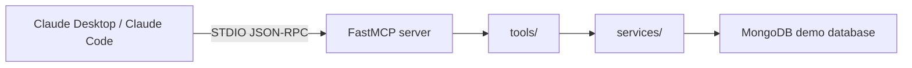

# AnalysisMCP

AnalysisMCP is a portfolio-ready Model Context Protocol (MCP) analytics server built around a single seeded MongoDB demo database and a Claude Desktop walkthrough.

It preserves the original AnalysisMCP tool contracts, strips away the multi-tenant and LibreChat-specific infrastructure, and leaves a clean local demo flow that is easy to explain, run, and show to a hiring manager or technical reviewer.

## Why this project exists

This project was rebuilt to do one thing well: let a local Claude Desktop client call analytics tools against a fixed demo dataset and explain the results in natural language.

The architecture keeps the original tool behavior intact while simplifying everything around it:

- one MongoDB demo database
- one seeded data contract
- one STDIO MCP transport path
- read-only aggregations with structured JSON output
- zero dependence on tenant routing or external SaaS services

## What the server exposes

The project exposes a fixed set of MCP tools for user, conversation, agent, token, and high-level operational analytics.

### Core tools

- System: `get_system_status`, `get_current_datetime`
- Users: `get_users`, `get_user_details`, `get_new_users`
- Conversations: `get_conversations`, `get_conversation_detail`, `get_conversations_with_feedback`, `search_conversations`, `get_conversation_tool_calls`
- Metrics: `get_overview_metrics`
- Agents and models: `get_agents`, `get_agent_usage`, `get_model_usage`
- Tokens: `get_token_usage_by_model`, `get_token_timeline`

The design deliberately keeps the model in charge of interpretation. Tools return structured JSON; the LLM decides how to compare, explain, and summarize the results.

## Architecture at a glance



## Quick start

### 1. Create and activate a virtual environment

```bash
python -m venv .venv
. .venv/bin/activate
```

On Windows PowerShell:

```powershell
py -m venv .venv
.\.venv\Scripts\Activate.ps1
```

### 2. Install project dependencies

```bash
pip install -e '.[dev]'
```

### 3. Start the demo MongoDB instance

```bash
docker compose -f docker-compose.demo.yml up -d
```

### 4. Seed the demo database

```bash
python scripts/seed_demo.py
```

### 5. Verify the contract and handshake

```bash
python scripts/verify_demo.py
python scripts/handshake_demo.py
```

### 6. Run the project through Claude Desktop

Use the example config in `demo/` as the starting point, then point Claude Desktop at this repo checkout and the local Python executable. The project is designed for a local demo workflow, not a production deployment.

## Demo database contract

The seeded database is intentionally deterministic and stable. It includes:

- 42 demo users
- 6 agents across multiple providers/models
- 24 conversations with realistic activity patterns
- 120 seeded messages
- feedback events and token usage data that show a meaningful outlier pattern

The verification script asserts that the seeded data matches the expected contract, which keeps the demo deterministic and easy to explain in front of reviewers.

## Repository layout

```text
.
├── src/analysis_mcp/
│   ├── db/
│   ├── models/
│   ├── services/
│   ├── tools/
│   ├── env.py
│   ├── server.py
│   └── utils.py
├── scripts/
│   ├── seed_demo.py
│   ├── verify_demo.py
│   ├── handshake_demo.py
│   └── check_publish.py
├── tests/
├── demo/
├── docker-compose.demo.yml
├── pyproject.toml
├── .env.example
├── ARCHITECTURE.md
├── README.md
├── LICENSE
└── .github/
```

## Local workflow and project constraints

This build is intentionally narrow in scope:

- the project targets one seeded database, not multi-tenant routing
- there is no external auth layer, no production data ingestion, and no background worker system
- the MCP server is optimized for the local Claude Desktop demonstration path
- tools remain read-only and structured for model-driven interpretation

Those constraints are deliberate. The goal is not to build a general-purpose platform; it is to make a reliable, explainable analytics demo that reads well for a portfolio or live walkthrough.

## Validation

The project includes lint, type-checking, and test validation in CI.

```bash
python -m ruff check .
python -m mypy src
python -m pytest -q
```

## License

This project is licensed under the MIT License. See [LICENSE](LICENSE) for details.
